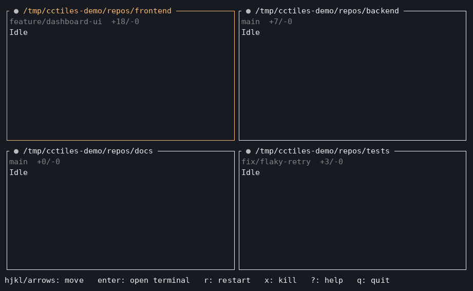

[日本語](README.ja.md) | English

# CC-Tiles

[](https://crates.io/crates/cctiles)
[](#license)
[](https://github.com/WaTeR-7/cctiles/actions/workflows/ci.yml)

A terminal UI (TUI) application for running and monitoring multiple [Claude Code](https://github.com/anthropics/claude-code) CUI sessions in parallel, written in Rust.

Run `cctiles`, pick a grid layout and a directory for each pane, and each pane (a **tile**) spawns and runs its own Claude Code session. Every tile shows a live, at-a-glance summary of what its session is doing, so you can keep several agents working in parallel without switching between a pile of terminal tabs to check on them.



## Features

- **Grid of live sessions** - lay out any number of rows/columns; each tile runs its own `claude` process.
- **At-a-glance status** - a colored indicator on each tile's title shows what its session is doing right now: idle, working, waiting on a permission prompt or a question, running a background task, or crashed. Driven by Claude Code's own [hooks](https://code.claude.com/docs/en/hooks.md), not by scraping the screen, so it's accurate even for background tasks a glance at the terminal wouldn't show.
- **Live activity feed** - each tile scrolls a running summary of recent tool calls and messages, so you can tell what a session is actually doing without opening it.
- **Git status per tile** - the current branch and working-tree diffstat (e.g. `main  +12/-3`), shown for any tile whose directory is a git repository.
- **Floating terminal** - press `Enter` on a tile to open a real, interactive terminal for that session in a floating overlay on top of the grid, so the rest of the grid stays visible around it; press `Ctrl+G` to go back.
- **Crash recovery** - a tile whose session exited unexpectedly shows a clear in-tile error instead of just going blank, and can be restarted in place.

## Requirements

- The [Claude Code CLI](https://github.com/anthropics/claude-code) (`claude`), installed and available on your `PATH`.
- A terminal emulator (cctiles is a TUI app, run directly in your terminal).

## Installation

```sh
cargo install cctiles
```

Or build from source:

```sh
git clone https://github.com/WaTeR-7/cctiles.git
cd cctiles
cargo build --release
./target/release/cctiles
```

## Usage

The first time you run `cctiles` (or any time with `--setup`), it walks you through a short setup:

1. Choose the grid size (rows/columns).
2. Choose a directory for each tile - each one gets its own `claude` session.

Your choices are saved to a config file (see [Configuration](#configuration)) and reused on the next launch.

### Keybindings

**Grid view**

| Key                | Action                                    |
| ------------------ | ----------------------------------------- |
| `h` `j` `k` `l` / arrow keys | Move focus between tiles        |
| `Enter`             | Open the focused tile as a floating terminal |
| `r`                 | Restart the focused tile's session         |
| `x`                 | Kill the focused tile's session            |
| `?`                 | Toggle the keybinding help overlay         |
| `q`                 | Quit                                       |

**Floating terminal**

| Key      | Action                                             |
| -------- | --------------------------------------------------- |
| (typing) | Forwarded to the session, as if typed directly       |
| `Ctrl+G` | Detach back to the grid (the session keeps running) |

## Configuration

Settings are stored as TOML, by default at your platform's standard config directory (e.g. `~/.config/cctiles/config.toml` on Linux):

```toml
rows = 2
cols = 2
tile_dirs = [
    "/path/to/project-a",
    "/path/to/project-b",
    "/path/to/project-c",
    "/path/to/project-d",
]
```

Use `--config <path>` to point at a different file, or `--setup` to redo the interactive setup even if a config already exists.

## Known limitations

- Two tiles pointed at the *same* directory at the same time can cross-wire each other's status and activity feed ([#68](https://github.com/WaTeR-7/cctiles/issues/68)). Give each tile its own directory for now.

See [open issues](https://github.com/WaTeR-7/cctiles/issues) for the rest of the roadmap.

## Contributing

Contributions, bug reports, and ideas are welcome. Please read [CONTRIBUTING.md](CONTRIBUTING.md) before opening a pull request, and note that participation in this project is governed by our [Code of Conduct](CODE_OF_CONDUCT.md).

## License

Licensed under either of

- MIT license ([LICENSE-MIT](LICENSE-MIT))
- Apache License, Version 2.0 ([LICENSE-APACHE](LICENSE-APACHE))

at your option.
